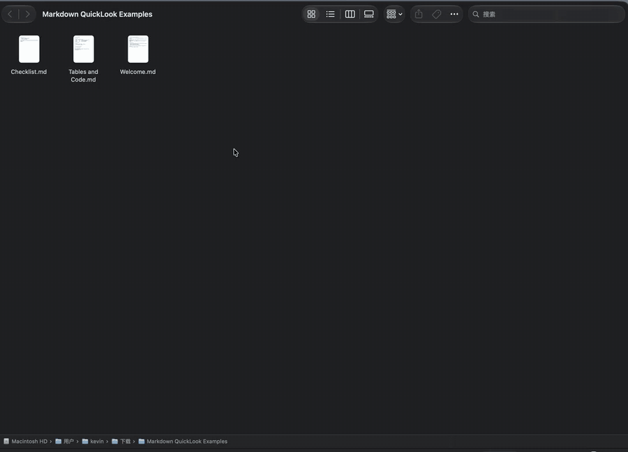
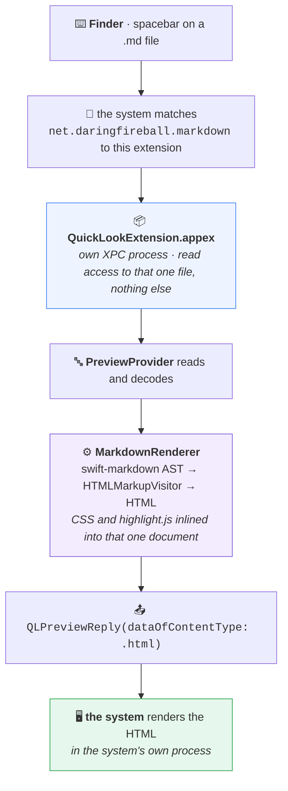

<div align="center">

# 🔍 md-quicklook

### Press space on a `.md` file in Finder and read it rendered, not as source.

A Quick Look preview extension for Markdown on macOS, built to hold as little of its own machinery
as possible — it returns HTML and draws nothing, so its only entitlement is `app-sandbox`.

<br/>

[](https://www.apple.com/macos/)
[](https://swift.org)
[](https://github.com/swiftlang/swift-markdown)
[](https://github.com/kevinave/md-quicklook/actions/workflows/ci.yml)
[](LICENSE)

<br/>



</div>

---

## Why

macOS has shipped the `net.daringfireball.markdown` type identifier for years but has never shipped
anything that renders it, so Quick Look falls back to plain text. This fills that gap.

|  | |
|---|---|
| 📝 | **GitHub-flavoured everything** — headings, tables, task lists, nested blockquotes, footnotes |
| 🎨 | **Syntax-highlighted code, offline** — highlight.js is inlined, never fetched |
| 🏷️ | **YAML front matter as metadata**, instead of being mangled into a heading |
| 🌓 | **Light and dark**, following the system |
| 🌍 | **Non-UTF-8 files decoded** rather than turned into mojibake — including GB18030 |
| 🔒 | **One entitlement in the extension:** `com.apple.security.app-sandbox` |

---

## How it works



The pivot is the last two steps. This is a **data-based** preview (`QLIsDataBasedPreview`): the
extension returns bytes and draws nothing, so the WebView belongs to the system, in the system's
process. Everything else follows from that.

> [!IMPORTANT]
> **Least privilege isn't earned here, it's structural.** Nothing is drawn locally and no local
> resources are loaded, so there is nothing to ask for beyond the file Quick Look already hands over.
> Extensions that host their own WebView need a read exception over the home directory — or the whole
> file system — just to load an image. This one needs no file entitlement at all.

---

<details>
<summary><b>Two more consequences of keeping the machinery thin</b></summary>

<br/>

**One Markdown implementation.** The extension and the `mdql` CLI both go through `MarkdownRenderer`,
so nothing re-parses Markdown by hand, and nested emphasis, `**` inside inline code, escapes and
bracketed link labels all behave per CommonMark. `Examples/inline-torture.md` is the regression file
for exactly those.

**No supervisor of its own.** There is no size cap and no timeout. Quick Look extensions are separate
processes whose lifecycle the system already manages, and that policy is better than one invented
here.

The reasoning and the known trade-offs are in [`docs/decisions.md`](docs/decisions.md).

</details>

<details>
<summary><b>Install</b> — no signed release; build it yourself</summary>

<br/>

```bash
brew install xcodegen
git clone https://github.com/kevinave/md-quicklook.git
cd md-quicklook
xcodegen generate
xcodebuild -project MarkdownQuickLook.xcodeproj -scheme MarkdownQuickLook \
  -configuration Release -derivedDataPath .build-xcode \
  ARCHS=arm64 ONLY_ACTIVE_ARCH=YES \
  CODE_SIGN_STYLE=Manual CODE_SIGN_IDENTITY="-" DEVELOPMENT_TEAM="" build
cp -R .build-xcode/Build/Products/Release/MarkdownQuickLook.app /Applications/
open /Applications/MarkdownQuickLook.app
```

Launching it once is what registers the extension. Confirm with:

```bash
pluginkit -mAvvv -i com.kevinave.mdquicklook.QuickLookExtension
```

A leading `+` means registered and enabled. Then select a `.md` file in Finder and press space.

`CODE_SIGN_IDENTITY="-"` is ad-hoc signing, which is enough to run on the machine that built it.
Substitute a Developer ID to hand the app to someone else, or the recipient will meet Gatekeeper.

</details>

<details>
<summary><b>What is in the repository</b></summary>

<br/>

| Piece | Role |
|:--|:--|
| `QuickLookExtension/` | the extension itself — a `QLPreviewProvider` returning HTML |
| `Sources/MarkdownRenderer/` | the only Markdown implementation; swift-markdown AST → HTML, CSS and highlight.js inlined |
| `App/` | a small menu bar app whose job is to host and register the extension |
| `Sources/mdql/` | a CLI running the same renderer — what makes rendering testable without Finder in the loop |
| `Examples/` | sample documents, including `inline-torture.md` |
| `docs/decisions.md` | why it is built this way, and the trade-offs |

The app it builds is `MarkdownQuickLook.app`, bundle identifier `com.kevinave.mdquicklook`.

</details>

<details>
<summary><b>Development</b></summary>

<br/>

```bash
swift test                                   # renderer tests, no Finder needed
swift run mdql Examples/inline-torture.md out.html
```

`qlmanage` is unreliable on macOS 27 betas — it crashes in its own process while servicing extension
requests. Use `mdql` to check rendering and Finder to check integration.

</details>

<details>
<summary><b>Relationship to the upstream project</b></summary>

<br/>

This started from [jzone3/markdown-quicklook](https://github.com/jzone3/markdown-quicklook) (MIT). It
is not a GitHub fork — the code was carried into a fresh repository — but the upstream commits are
preserved in this repository's history. Three things changed:

| | upstream | here |
|---|---|---|
| Preview | `NSViewController` rendering `NSAttributedString` | data-based `QLPreviewProvider` returning HTML |
| Inline parsing | hand-rolled with string indices | the swift-markdown AST the project already depended on |
| Extension entitlements | `app-sandbox` + `user-selected.read-only` | `app-sandbox` |

Front matter handling, the wider decoding fallbacks, dependency pinning and the removal of the input
size cap came with those.

</details>

---

<div align="center">

MIT © [kevinave](https://github.com/kevinave) — continuing the upstream license.
Bundled and vendored assets keep their own terms, see [`THIRD_PARTY_LICENSES.md`](THIRD_PARTY_LICENSES.md).

</div>
